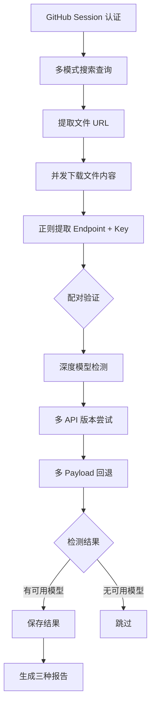
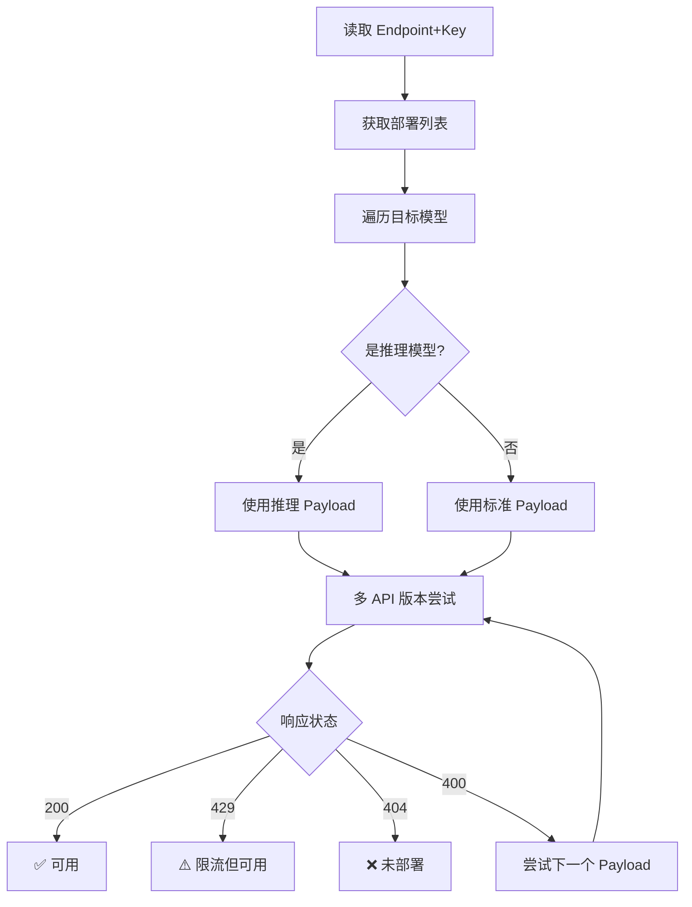
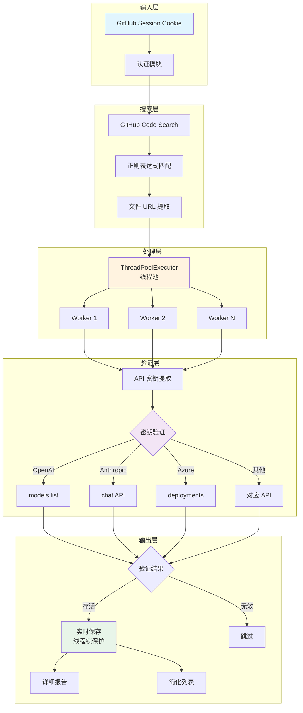

# 🔐 GitHub API Key Scanner

<div align="center">


**一个强大的 GitHub API 密钥泄露扫描工具集，支持 17+ 个 AI API 服务商的密钥扫描和验证。**

[功能特性](#-功能特性) •
[支持服务商](#-支持的服务商) •
[快速开始](#-快速开始) •
[使用方法](#-使用方法) •
[Azure 工具集](#-azure-工具集)

</div>

---

## 📖 项目简介

GitHub API Key Scanner 是一个专门用于扫描 GitHub 上泄露的 API 密钥的安全工具。它通过 GitHub Session 认证搜索，能够发现普通 API 搜索无法找到的代码，并自动验证密钥的有效性。

### 适用场景

- 🔍 **安全审计**: 检测自己项目中是否存在泄露的 API 密钥
- 🛡️ **安全研究**: 了解 API 密钥泄露的常见模式
- 📊 **风险评估**: 评估 API 密钥暴露的风险程度

## ✨ 功能特性

- 🔐 **GitHub Session 认证搜索** - 突破普通 API 搜索限制，发现更多结果
- ⚡ **多线程并发处理** - 使用 ThreadPoolExecutor 实现高效并发扫描
- 💾 **实时文件保存** - 线程锁保护的实时结果保存机制
- 🔍 **正则表达式密钥提取** - 精准匹配各类 API 密钥格式
- ✅ **自动密钥验证** - 通过官方 API 验证密钥有效性
- 📊 **详细状态报告** - 区分存活、过期、配额超限等多种状态
- 🎯 **多服务商支持** - 支持 17+ 个主流 AI API 服务商

## 🌐 支持的服务商

| 服务商              | Key 前缀                  | 扫描器文件               | 验证方式    | 状态 |
| ------------------- | ------------------------- | ------------------------ | ----------- | ---- |
| OpenAI              | `sk-proj-`, `sk-svcacct-` | `openai_scanner.py`      | models.list | ✅   |
| Anthropic           | `sk-ant-api03-`           | `anthropic_scanner.py`   | chat        | ✅   |
| OpenRouter          | `sk-or-v1-`               | `openrouter_scanner.py`  | auth/key    | ✅   |
| SiliconFlow         | `sk-` (48 字符)           | `siliconflow_scanner.py` | user/info   | ✅   |
| Groq                | `gsk_`                    | `groq_scanner.py`        | chat        | ✅   |
| DeepSeek            | `sk-`                     | `deepseek_scanner.py`    | balance     | ✅   |
| Aliyun (阿里云)     | `sk-`                     | `aliyun_scanner.py`      | DashScope   | ✅   |
| Moonshot (月之暗面) | `sk-`                     | `moonshot_scanner.py`    | balance     | ✅   |
| Grok/X.ai           | `xai-`                    | `grok_scanner.py`        | chat        | ✅   |
| Novita              | `sk_`                     | `novita_scanner.py`      | chat        | ✅   |
| Fireworks           | `fw_`                     | `fireworks_scanner.py`   | chat        | ✅   |
| Chutes              | `cpk_`                    | `chutes_scanner.py`      | chat        | ✅   |
| Requesty            | `sk-` (80+字符)           | `requesty_scanner.py`    | chat        | ✅   |
| AiPipe              | `eyJ` (JWT)               | `aipipe_scanner.py`      | chat        | ✅   |
| Vercel              | `vck_`                    | `vercel_scanner.py`      | chat        | ✅   |
| NewAPI              | `sk-`                     | `newapi_scanner.py`      | chat + user | ✅   |
| Azure OpenAI        | 32 位十六进制             | `azure_full_scanner.py`  | deployments | ✅   |

## 🚀 快速开始

### 环境要求

- Python 3.8+
- pip 包管理器

### 安装步骤

1. **克隆仓库**

```bash
git clone https://github.com/eecu/github_go.git
cd github-api-key-scanner
```

2. **创建虚拟环境 (推荐)**

```bash
python -m venv .venv
# Windows
.venv\Scripts\activate
# Linux/macOS
source .venv/bin/activate
```

3. **安装依赖**

```bash
pip install -r requirements.txt
```

4. **配置环境变量**

```bash
# 复制示例配置文件
cp .env.example .env

# 编辑 .env 文件，填入必要的配置
```

## ⚙️ 配置说明

### 环境变量

在 `.env` 文件中配置以下变量：

```bash
# GitHub Session 配置 (必需)
# 获取方法： 浏览器登录 GitHub -> F12 -> Application -> Cookies -> user_session
GITHUB_SESSION=your_github_session_cookie

# Azure OpenAI 配置 (可选，用于 Azure 工具)
AZURE_OPENAI_ENDPOINT=https://your-resource.openai.azure.com
AZURE_OPENAI_API_KEY=your-api-key-here
AZURE_OPENAI_API_VERSION=2025-04-01-preview
```

### 获取 GitHub Session

1. 使用浏览器登录 GitHub
2. 按 `F12` 打开开发者工具
3. 切换到 `Application` 标签页
4. 在左侧 `Cookies` 中找到 `github.com`
5. 复制 `user_session` 的值

## 📖 使用方法

### 主扫描器 (多目标)

```bash
# 运行主扫描器（包含 OpenAI, Anthropic, OpenRouter, Google）
python main.py
```

### 单独服务商扫描器

每个扫描器都可以独立运行：

```bash
# OpenAI 密钥扫描
python openai_scanner.py

# Anthropic 密钥扫描
python anthropic_scanner.py

# OpenRouter 密钥扫描
python openrouter_scanner.py

# SiliconFlow 密钥扫描
python siliconflow_scanner.py

# Groq 密钥扫描
python groq_scanner.py

# DeepSeek 密钥扫描
python deepseek_scanner.py

# Aliyun 密钥扫描
python aliyun_scanner.py

# Moonshot 密钥扫描
python moonshot_scanner.py

# Grok/X.ai 密钥扫描
python grok_scanner.py

# Novita 密钥扫描
python novita_scanner.py

# Fireworks 密钥扫描
python fireworks_scanner.py

# Chutes 密钥扫描
python chutes_scanner.py

# Requesty 密钥扫描
python requesty_scanner.py

# AiPipe 密钥扫描
python aipipe_scanner.py

# Vercel 密钥扫描
python vercel_scanner.py

# NewAPI 密钥扫描
python newapi_scanner.py

# Azure OpenAI 密钥扫描
python azure_full_scanner.py
```

### 通用扫描器

```bash
# 使用通用扫描器自定义扫描目标
python universal_scanner.py
```

## 🔷 Azure 工具集

Azure OpenAI 相关的专用工具：

| 工具          | 文件                          | 功能描述                                  |
| ------------- | ----------------------------- | ----------------------------------------- |
| ⭐ 完整扫描器 | `azure_full_scanner.py`       | **一体化工具：扫描 + 深度检测** (推荐)    |
| 批量验证器 V2 | `azure_batch_validator_v2.py` | 增强版验证器 (支持 GPT-5/5.1，多版本回退) |

> 💡 **注意**: 旧版 Azure 工具 (azure_scanner.py, azure_batch_validator.py 等) 已移至 `azure_old/` 目录

### Azure 工具使用示例

```bash
# ⭐ 推荐：完整扫描器 (扫描 + 深度检测一体化)
python azure_full_scanner.py

# 对已有配置进行批量验证 (V2 增强版，推荐用于 GPT-5+ 模型)
python azure_batch_validator_v2.py
```

### Azure 完整扫描器工作原理

`azure_full_scanner.py` 是一体化的 Azure OpenAI 扫描工具，整合了扫描和深度检测功能：

#### 工作流程



#### 核心特性

1. **一体化流程**：发现配置后立即进行深度模型检测，无需分步操作
2. **智能搜索**：11 种基础查询 + 模型名称组合，覆盖面广
3. **深度检测**：对每个 Endpoint 测试 40+ 个目标模型
4. **多版本回退**：自动尝试 6 个 API 版本 (2025-01-01-preview 起)
5. **推理模型支持**：自动识别 O1/O3/O4/GPT-5/GPT-5.1 系列

#### 输出文件

| 文件                      | 内容                              |
| ------------------------- | --------------------------------- |
| `azure_full_scan_*.txt`   | 详细扫描结果 (Endpoint、来源等)   |
| `azure_full_simple_*.txt` | 简化列表 (Endpoint,Key)           |
| `azure_full_report_*.txt` | 深度检测报告 (可用模型、响应时间) |

### Azure 批量验证器 V2 工作原理

`azure_batch_validator_v2.py` 是针对新一代模型（GPT-5、GPT-5.1 等）优化的增强版验证器：

#### 核心改进

1. **多 API 版本回退机制**

   ```
   2025-01-01-preview → 2024-12-01-preview → 2024-10-01-preview → ...
   ```

   按优先级依次尝试，确保新模型可被正确检测。

2. **智能推理模型识别**

   - 自动识别 O1/O3/O4 系列及 GPT-5/5.1 系列为推理模型
   - 推理模型使用 `max_completion_tokens` 而非 `max_tokens`
   - 推理模型不设置 `temperature` 参数

3. **多层 Payload 回退策略**

   ```
   推理模型: max_completion_tokens → 最小化参数 → max_tokens
   标准模型: max_tokens+temperature → max_tokens → max_completion_tokens → 最小化
   ```

   确保各种参数组合都能被正确测试。

4. **增强错误处理**
   - 区分 404 (未部署)、429 (限流)、401 (Key 无效) 等状态
   - 限流状态也视为"模型可用"的证据

#### 检测流程



## 📁 输出文件说明

扫描结果保存在 `api_data/` 目录下：

| 文件类型   | 命名格式                            | 内容描述                             |
| ---------- | ----------------------------------- | ------------------------------------ |
| 详细报告   | `*_live_keys_YYYYMMDD_HHMMSS.txt`   | 包含密钥、状态、来源、时间等详细信息 |
| 简化列表   | `*_keys_simple_YYYYMMDD_HHMMSS.txt` | 仅包含密钥列表，便于批量处理         |
| Azure 报告 | `azure_batch_report_*.txt`          | Azure 批量验证的详细报告             |

### 输出示例

**详细报告格式:**

```
🔑 OpenAI API Key
   密钥: sk-proj-xxxx...
   状态: 🟢 存活 (Live)
   仓库: user/repo
   文件: path/to/file.py
   链接: https://github.com/...
   发现时间: 2024-01-01 12:00:00
------------------------------------------------------------
```

**简化列表格式：**

```
sk-proj-xxxxxxxxxxxxxxxxxxxxxxxxxx
sk-svcacct-yyyyyyyyyyyyyyyyyyyyyy
```

## 📂 项目结构

```
github-api-key-scanner/
├── 📄 main.py                    # 主扫描器 (多目标)
├── 📄 universal_scanner.py       # 通用扫描器
│
├── 🔐 服务商扫描器
│   ├── openai_scanner.py         # OpenAI
│   ├── anthropic_scanner.py      # Anthropic
│   ├── openrouter_scanner.py     # OpenRouter
│   ├── siliconflow_scanner.py    # SiliconFlow
│   ├── groq_scanner.py           # Groq
│   ├── deepseek_scanner.py       # DeepSeek
│   ├── aliyun_scanner.py         # Aliyun
│   ├── moonshot_scanner.py       # Moonshot
│   ├── grok_scanner.py           # Grok/X.ai
│   ├── novita_scanner.py         # Novita
│   ├── fireworks_scanner.py      # Fireworks
│   ├── chutes_scanner.py         # Chutes
│   ├── requesty_scanner.py       # Requesty
│   ├── aipipe_scanner.py         # AiPipe
│   ├── vercel_scanner.py         # Vercel
│   └── newapi_scanner.py         # NewAPI
│
├── 🔷 Azure 工具集
│   ├── azure_full_scanner.py       # ⭐ 完整扫描器 (扫描+深度检测)
│   └── azure_batch_validator_v2.py # 批量验证器 V2 (支持 GPT-5/5.1)
│
├── 📁 azure_old/                   # 旧版 Azure 工具 (存档)
│   ├── azure_scanner.py            # 旧版扫描器
│   ├── azure_batch_validator.py    # 旧版验证器
│   ├── azure_openai_check.py       # 模型可用性检测
│   ├── azure_openai_concurrent_detector.py # 异步并发检测
│   ├── azure_openai_model_detector.py      # 部署模型检测
│   └── azure_openai_quick_check.py # 快速检查
│
├── 📁 api_data/                  # 扫描结果输出目录
├── 📁 .venv/                     # Python 虚拟环境
│
├── 📄 .env.example               # 环境变量示例
├── 📄 .env                       # 环境变量配置 (需自行创建)
├── 📄 requirements.txt           # Python 依赖
└── 📄 README.md                  # 项目文档
```

## 🏗️ 技术架构



## 🔒 安全声明

### ⚠️ 重要提示

1. **合法使用**: 本工具仅供安全研究和教育目的使用
2. **授权检测**: 仅在您有权限的范围内使用本工具
3. **负责任披露**: 如发现泄露的密钥，请负责任地通知相关方
4. **不得滥用**: 严禁使用发现的密钥进行任何未授权的访问

### 🚫 免责声明

- 本工具的开发者不对任何滥用行为负责
- 使用本工具所产生的任何后果由使用者自行承担
- 请确保您的使用符合当地法律法规
- 发现的任何有效密钥应仅用于通知密钥所有者

## 🤝 贡献指南

欢迎贡献代码！请遵循以下步骤：

1. **Fork** 本仓库
2. 创建特性分支 (`git checkout -b feature/AmazingFeature`)
3. 提交更改 (`git commit -m 'Add some AmazingFeature'`)
4. 推送到分支 (`git push origin feature/AmazingFeature`)
5. 开启 **Pull Request**

### 贡献方向

- 🆕 添加新的服务商支持
- 🐛 修复 Bug
- 📝 完善文档
- ⚡ 性能优化
- 🧪 添加测试用例

## 📜 License

本项目采用 MIT 许可证 - 查看 [LICENSE](LICENSE) 文件了解详情。

---

<div align="center">

**⭐ 如果这个项目对您有帮助，请给一个 Star！⭐**

Made with ❤️ by Security Researchers

</div>
